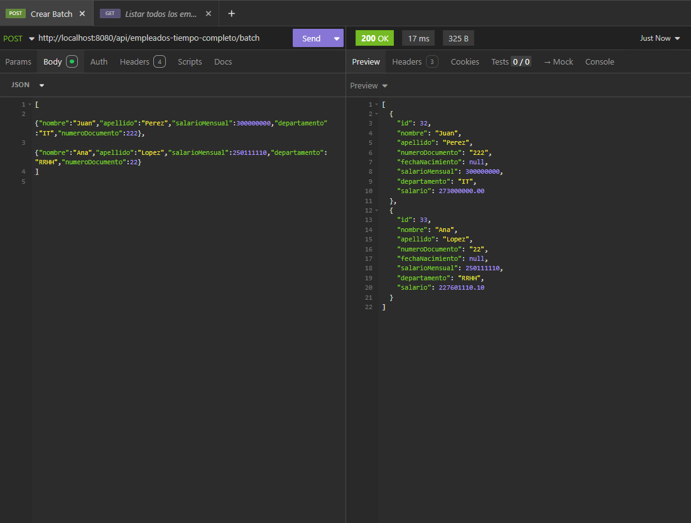
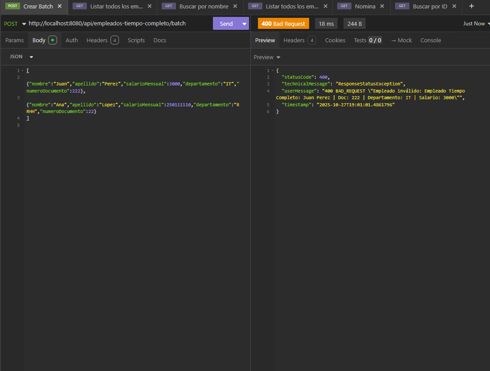
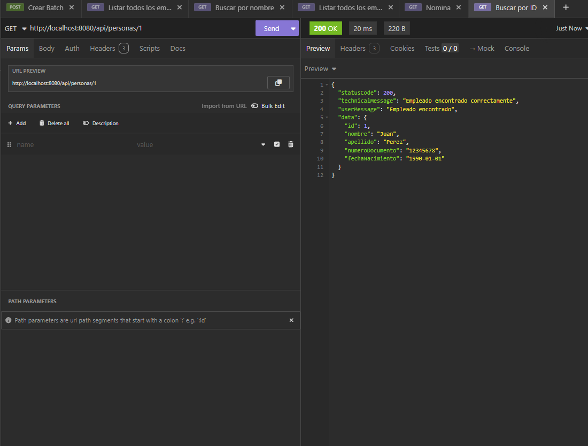
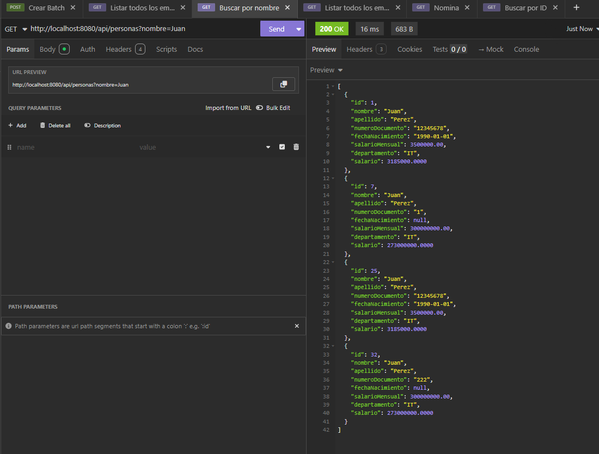
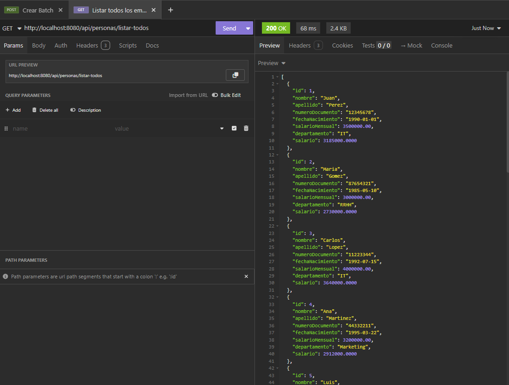
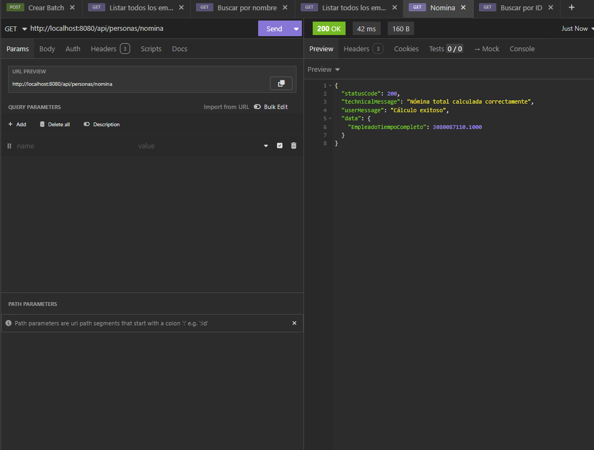
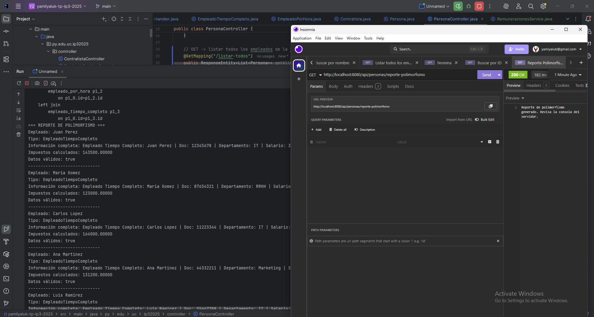

# yamilyaluk-tp-lp3-2025

## Instrucciones de Ejecución
1. Clonar el repositorio:
   git clone https://github.com/Siegfried177/yamilyaluk-tp-lp3-202

2. Entrar al proyecto:
   cd yamilyaluk-tp-lp3-2025

3. Configurar la base de datos en `src/main/resources/application.properties`

4. Ejecutar la aplicación con Maven:
   mvn spring-boot:run

5. La API estará disponible en:
   http://localhost:8080/api/personas

## CURLs
1. Batch de varios Empleados Tiempo Completo (Son validados) -- POST http://localhost:8080/api/empleados-tiempo-completo/batch
2. Listar todos los empleados -- GET http://localhost:8080/api/personas/listar-todos
3. Buscar empleado por ID -- GET http://localhost:8080/api/personas/x
4. Buscar empleado por Nombre -- GET http://localhost:8080/api/personas?nombre=""
5. Consulta de nomina -- GET http://localhost:8080/api/personas/nomina
6. Reporte de Polimorfismo -- GET http://localhost:8080/api/personas/reporte-polimorfismo

## Screenshots

